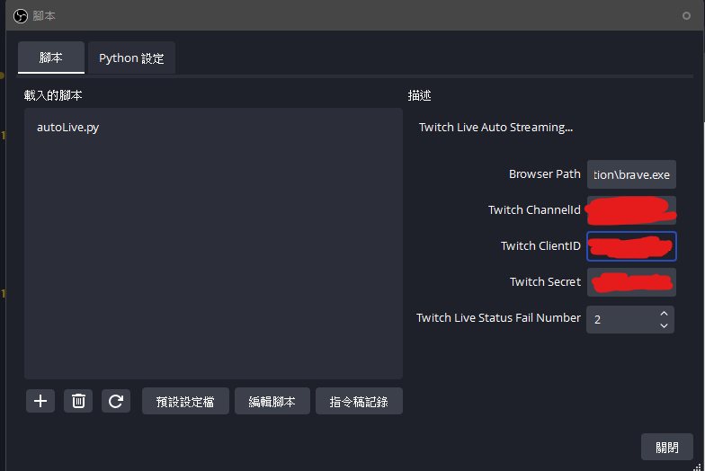
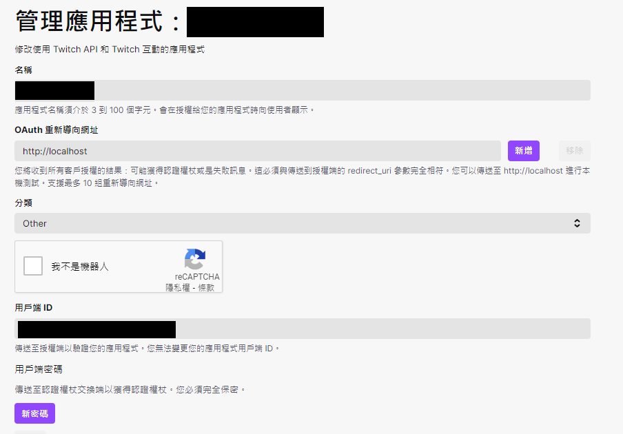

# obs Live To Youtube For Twitch

#### 目前已知 瀏覽器插件 有一個 BUG 會尚未 LOADING 狀態卡 120秒 刷新畫面

###### 檢查 Twitch 頻道是否直播自動執行直播串流以及結束串流

> Python 需求

- asyncio

- datetime

- zoneinfo

- requests

- subprocess


> 安裝教學以及重要事像

- [安裝教學](./Install.md)


> 瀏覽器插件 `Twitch-Theater`

```
此插件為了 Obs Python 腳本準備

執行目的檢查網址是否為 https://www.twitch.tv/{channelId}
自動點擊頭像進入播放器並且切換劇場模式 (檢查聊天室是否彈出並隱藏)

定時檢查播放是否存在 Loading 狀態持續 120 秒自動刷新頁面
定時檢查頁面是否存在 播放器錯誤出現 刷新 按鈕 自動點擊 
```

> Obs 插件 (Python)

`Browser Path`: 是瀏覽器安裝路徑只要是 chrome 或 chromium 核心都可以兼容

範例: `C:\Program Files\BraveSoftware\Brave-Browser\Application`

`Twitch Channel ID`: 範例中 `XXXXX` 就是頻道ID

範例: `https://www.twitch.tv/xxxxx` 

`Twitch Clinet ID` 以及 `Twitch Secret` 請至 `https://dev.twitch.tv/console` 申請

`Twitch Live Status Fail Number`: 目標頻道停止直播, 檢查狀態未直播失敗 X 次 才會結束 直播串流 以及 關閉瀏覽器



> Twitch Clinet ID = 用戶端 ID

> Twitch Secret  請點擊 新密碼 即可獲得


